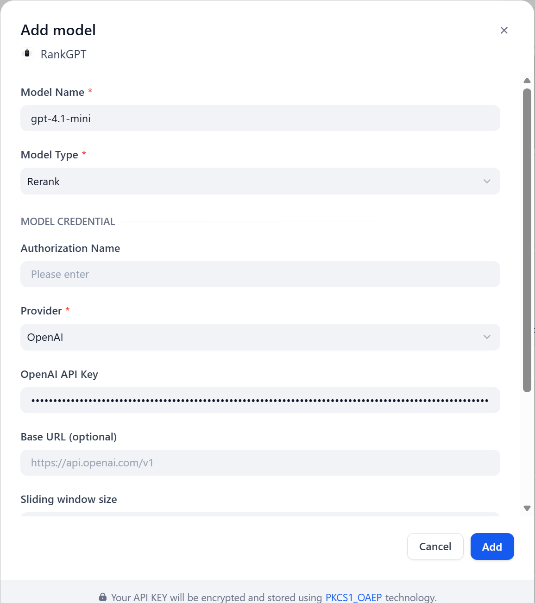

# RankGPT Dify Plugin

LLM-based RankGPT reranker plugin for Dify, supporting OpenAI and Google Gemini.

**Author:** [ki3dn](https://github.com/ki3nd)   
**Type:** model   
**Github Repo:** [https://github.com/ki3nd/rankgpt-dify-plugin](https://github.com/ki3nd/rankgpt-dify-plugin)   
**Github Issues:** [issues](https://github.com/ki3nd/rankgpt-dify-plugin/issues)  

## Overview

This plugin adds a `rerank model provider` to Dify and uses an LLM to reorder retrieved documents by query relevance.

## Features

- Supports **OpenAI** and **Google Gemini** providers
- RankGPT-style permutation reranking
- Sliding-window reranking for longer document lists
- Rank-based pseudo-score output (`1/(rank+1)`)

## Configure In Dify

When configuring the `rankgpt` provider in Dify:

| Field | Description |
|---|---|
| `provider` | `openai` or `gemini` |
| `model` | e.g. `gpt-4o-mini` or `gemini-2.0-flash` |
| `openai_api_key` | OpenAI API key *(OpenAI only)* |
| `openai_base_url` | Optional, for OpenAI-compatible endpoints *(OpenAI only)* |
| `gemini_api_key` | Google AI Studio API key *(Gemini only)* |
| `window_size` | Sliding window size (default `20`) |
| `step_size` | Sliding step size (default `10`) |
| `max_doc_words` | Max words per passage before truncation (default `300`) |

  

## How Reranking Works

1. The plugin builds a RankGPT-style prompt with the query and indexed passages.
2. The LLM returns a ranking order (e.g. `[3] > [1] > [2]`).
3. The plugin parses the order, removes duplicates and invalid indices, and applies a safe fallback for missing ones.
4. Results are returned to Dify as `RerankResult`.

## Notes

- LLM-based reranking — latency and cost depend on model choice and document count.
- For large document sets, tune `window_size` and `step_size` to avoid oversized prompts.
- `score_threshold` applies to a rank-based pseudo-score, not a true relevance probability.
